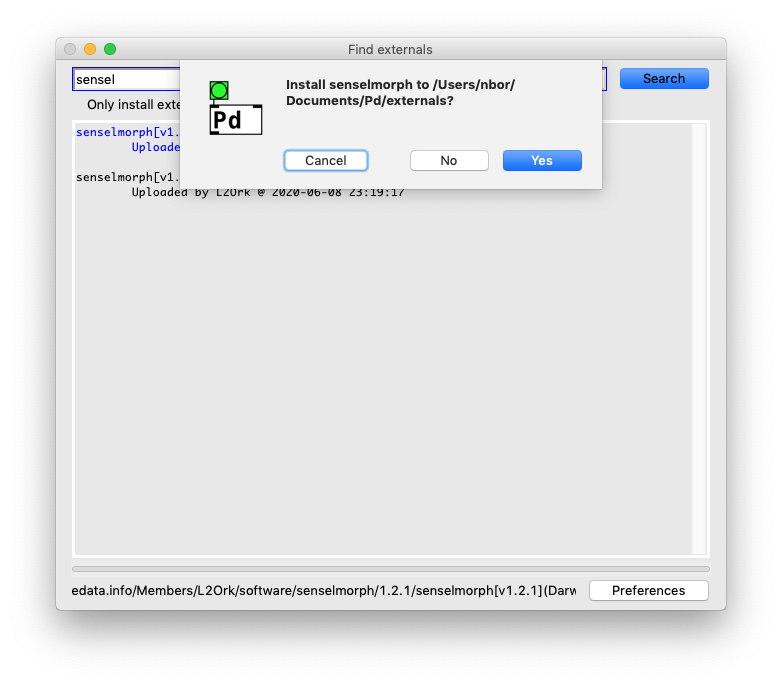

# DISIS/L2Ork Sensel 

[Pd-L2Ork](https://l2ork.bukvic.net/main/make-your-own-l2ork/software/) and [Pure-Data](http://msp.ucsd.edu/software.html) external for interfacing with the [Sensel Morph](http://sensel.com/morph)

by [Rachel Hachem](https://github.com/rachelhachem) and Ivica Ico Bukvic <ico@bukvic.net>

Part of the [ICAT Laptop Orchestra at Virgina Tech](http://l2ork.icat.vt.edu)

Released under the [GPL v3 license](https://www.gnu.org/licenses/gpl-3.0.en.html)

# SIMPLE INSTALLATION

Use the deken package manager to install the externals. In Pure Data, go to the "Help" menu and select **Find Externals**. Search for `sensel` or `senselmorph` and you will be given installation options. 

Install in Documents/Pd/ as recommmended by deken, unless you have a non-standard installation. 

This installs the objects as well as helpfiles and several examples that can be found in your <user documents>/Pd/externals/senselmorph folder. 
 
Here's what this looks like on a Mac after selecting a package to install in the deken panel - windows and linux are very simlar:


# BUILD INSTRUCTIONS

To build for Pd-L2Ork (pd-vanilla setup may be similar with some subtle changes in the include paths and likely does not require MSYS environment, so on Windows changes may be more significant):

1. Set up a build environment:

  * On Windows follow instructions on setting up the MSYS2 environment for Pd-L2Ork (make sure it matches your OS in terms of 32-bit vs 64-bit--most modern iterations of Windows are 64-bit). Info on how to do this can be found in the [pd-l2ork repository.](https://github.com/pd-l2ork/pd-l2ork/blob/master/README.md#windows-32-bit-using-msys2)

  * On Linux and OSX make sure you have your build gcc environment all set up (consult the OS documentation)

2. Install the Sensel lib for your OS found in the [Sensel API repo](https://github.com/sensel/sensel-api/tree/master/sensel-install)

3. Using a terminal (in Windows use the MSYS2 MinGW 32-bit shell) go into this folder and run the following command (these options are assuming you have everything installed in a default path--if you don't you will need to adjust paths accordingly):

  * Linux: `make pdincludepath=/usr/include/pd-l2ork/`

  * OSX: `make pdincludepath=/Applications/Pd-l2ork.app/Contents/Resources/app.nw/include/pd-l2ork/`

  * Windows: `make pdincludepath=/c/Program\ Files\ \(x86\)/Pd-L2Ork/include/pdl2ork pdbinpath=/c/Program\ Files\ \(x86\)/Pd-L2Ork/bin/`

4. If everything compiles correctly, you should be able to run Pd-L2Ork or Pure Data Vanilla and open the `sensel-help.pd` to test it out.

# INSTALLATION
Future installations will be mediated by the [deken](https://github.com/pure-data/deken) package manager. If you need to install from this repository, use the following directions.

## macOS

### Pd-L2Ork

sensel object comes preinstalled with Pd-L2Ork.

### Vanilla PD

Copy the
```
sensel.pd_darwin
sensel-help.pd
sensel-led.pd
```
files from this repo to your `~/Documents/Pd` folder. You may want to make a "sensel" directory so you can put these files in `~/Documents/Pd/sensel`.

## Windows

### Pd-L2Ork

sensel object comes preinstalled with Pd-L2Ork.

### Vanilla PD

Copy the
```
sensel.dll
sensel-help.pd
sensel-led.pd
LibSensel.dll
LibSensel.lib
LibSenselDecompress.dll
LibSenselDecompress.lib
```
files from this repo to your user `Documents/Pd` folder. You may want to make a "sensel" directory so you can put these files in user `/Documents/Pd/sensel`.


## Linux

### Pd-L2Ork

sensel object comes preinstalled with Pd-L2Ork.

### Vanilla PD

Copy the
```
sensel.pd_linux
sensel-help.pd
sensel-led.pd
```
files from this repo to your `~/Documents/Pd` folder. You may want to make a "sensel" directory so you can put these files in `~/Documents/Pd/sensel`.

# USE

## Messages to the `sensel` object inlet:

* `discover`: discovers and connects to the first available sensel morph device
* `identify:` lists all sensel morph devices' serial numbers in the console
* `disconnect`: disconnects from a connected sensel morph device
* `connect <serial-number>`: connects to a device with a matching serial number
* `poll`: sets the polling rate in ms (1-100) at which the contact data is outputted. Each contact has 20 arguments described below
* `led <id> <brightness(0-100)>`: sets the sensel morph led brightness. Note that sending a lot of led messages can quickly bog down the sensel devicem so rate control is encouraged (e.g. see the sensel-led abstraction)


## Messages from `sensel` object outlets:

### right outlet
Indicates connection status (1=connected, 0=disconnected)

### left outlet
List of all (maximum 16) contact points, with each contact output as a list consisting of 20 arguments:

1. contact point number
2. contact status (0=invalid , 1=start , 2=move , 3=end)
3. orientation
4. major axis
5. minor axis
6. delta x
7. delta y
8. delta force
9. delta area
10. min x
11. min y
12. max x
13. max y
14. peak x
15. peak y
16. peak force
17. x position
18. y position
19. total force
20. area

More detailed descriptions of the contact data can be found in the [Sensel API guide.](http://guide.sensel.com/api/#contact-data)

# NOTES
Currently, the external only supports detecting of individual contact points and their traits. Future revisions should focus on outputting the grayscale matrix of the surface pressure in a Gem-compatible format (and/or using other Pure-Data-compatible matrix formats that may be used by alternative visual data processing libraries).

# CHANGELOG

### 2020-04-13 0.9.0

Initial release by Rachel Hachem under the guidance of Ivica Ico Bukvic.

### 2020-05-20 1.0.0

Threaded implementation with additional features, including, disconnect, free, identify, improved console output, versioning, and updated help file by Ivica Ico Bukvic .

### 2020-05-22 v.1.1.0

Improved integration of the contacts API to fix contact id and provide contact status, as well as address missed contact status changes, reworked polling logic and removed reliance on the external metro, added total contact count, and setting the polling time by Ivica Ico Bukvic.
Added SimpleSenselSynth example by [Peter Nyboer](https://github.com/nyboer).

### 2020-05-22 v.1.2.0

Introduced ability to change LED brightness and further improved the help file by Ivica Ico Bukvic.

### 2021-12-28 v.1.2.1

Improved build script to support raspbian and improved start-up messaging and pathfinding of the required dynamically linked libraries <ico@bukvic.net>
